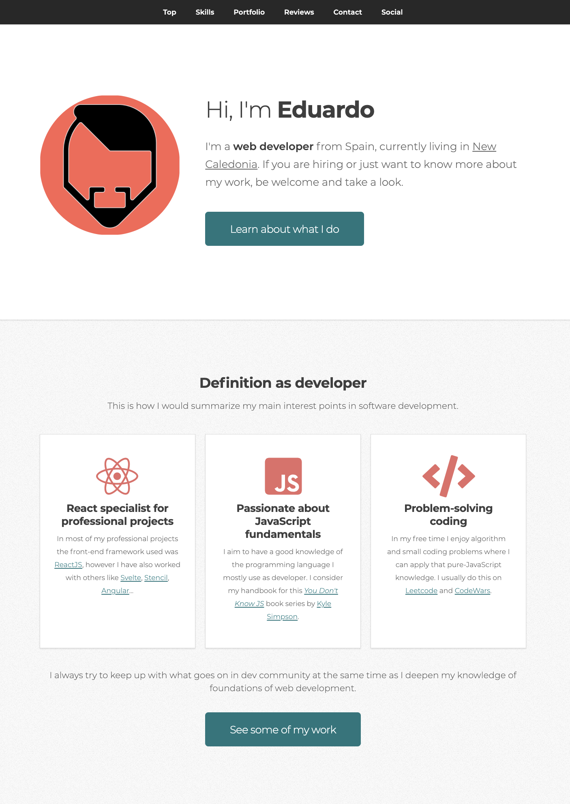

# Personal portfolio by ed-sa-ma

Site implemented by [ed-sa-ma](https://twitter.com/ed_sa_ma) for professional promotion, including samples of personal projects, opinions by colleagues from previous projects, links to all social media accounts of interest or contact form.

 

  

## Technical description

The implementation is based in HTML, SCSS and vanilla JavaScript. In order to render repeating pieces of HTML markup like lists/grids we use [custom elements](https://developer.mozilla.org/en-US/docs/Web/Web_Components/Using_custom_elements). The idea is being able to control the content of the page with JS objects instead of directly in the markup. For this use case we don't attach shadow DOM to avoid style isolation since we store all styles in one single SCSS file.

Additionally all this Javascript is served using [ES modules](https://developer.mozilla.org/en-US/docs/Web/JavaScript/Guide/Modules).

## Credits

### Design from [HTML5 UP](https://html5up.net/)

---

### Color theme chosen with [Coolors](https://coolors.co/)

---

### Hosted by [Netlify](https://netlify.com/)

---

### Icons by [font-awesome](https://fontawesome.com/)
