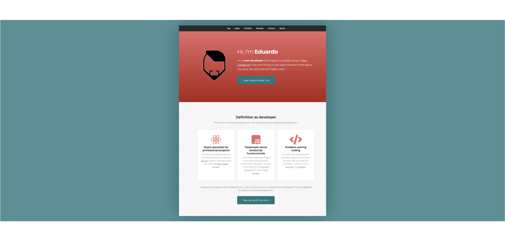

# Personal portfolio by ed-sa-ma

Site implemented by [ed-sa-ma](https://twitter.com/ed_sa_ma) for professional promotion, including samples of personal projects, opinions by colleagues from previous projects, links to all social media accounts of interest or contact form.

## Technical description

The implementation is based in [SvelteKit](https://kit.svelte.dev/), the applicstion framework powered by [Svelte](https://svelte.dev/). We use [Prismic](https://prismic.io/) as Content Management System, connected to an endpoint accessible by our application on load. By using [adapter-static](https://github.com/sveltejs/kit/tree/master/packages/adapter-static) we can prerender the whole application at build time. The result of that build are static HTML, CSS and JS files, which are then served by [Netlify](https://netlify.com):

## Credits

---

### Implemented in [SvelteKit](https://kit.svelte.dev/) 🧡

---

### Content managed and delivered by [Prismic](https://prismic.io/) 💛

---

### Design from [HTML5 UP](https://html5up.net/) 💜

---

### Color theme chosen with [Coolors](https://coolors.co/) 💙

---

### Hosted by [Netlify](https://netlify.com/) 💚

---

### Icons by [font-awesome](https://fontawesome.com/) 🖤

---
